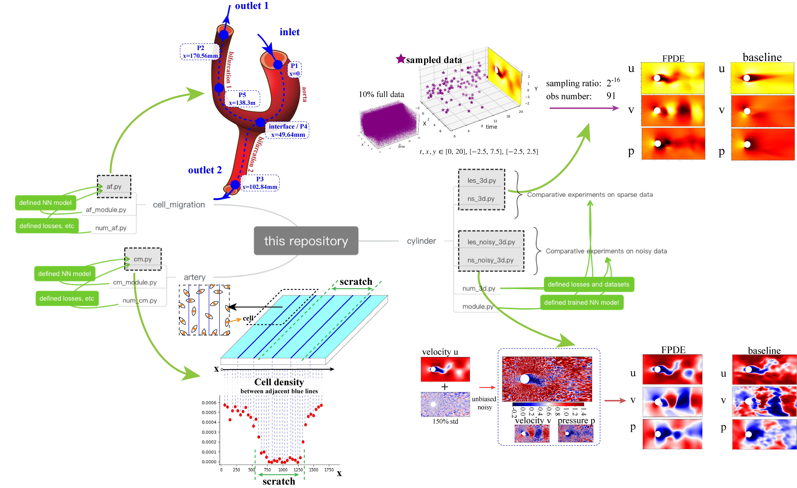

# Filtered PDE, a modified constraint of PINN

## About this repository
This repository is the code for PINN-related research. We design an alternative constraint to the physical constraints in PINN, the FPDE constraint. This repository contains three experiments, which we designed to verify the effectiveness of FPDE in improving PINN.This document only provides an overview. Each file has comments for description. Please use it in conjunction with the article.
This project uses the Pytorch framework for training; the training recording tool uses tensorboard. To start tensorboard, please enter `%tensorboard --logdir your_logs_path` in the terminal after installation.

### &emsp;Modeling the flow around a circular cylinder
In this experiment, we modeled flow data around cylinders of different qualities. Among them, the FPDE-constrained model is used as the experimental group, and the conventional PINN-constrained model is used as the control group. The experiment can be divided into two groups:
+ The goal of the first group is to quantitatively examine the impact of different amounts of training data on FPDE modeling results. The results can demonstrate the modeling ability of FPDE under sparse data. 
+ The second group of goals quantitatively examines the impact of training data containing different noises on FPDE modeling results. The results can show the ability of FPDE to resist noise modes.

The training code for this experiment is in the folder "cylinder".

### &emsp;Modeling the blood in Y-shaped artery
In order to test the improvement brought by FPDE in modeling actual data, this experiment modeled actual Y-shaped artery blood flow. In this experiment, a small part of the measured data will be used for training, and the blood flow of the entire artery will be modeled. Finally, the modeling results will be compared with actual measured data.

### &emsp;Modeling the cell density in scratch repair
This experiment is designed to test the performance of FPDE under extreme circumstances. 
Cells migrate to repair scratches, and an indicator of cell migration is cell density. This experiment will use the cell migration equation to model the migration results of cells under different initial conditions. However, since most of the equations under initial conditions are unknown, there are very few points that can be used for physical constraints.

## List of code (more detailed description is in the code comments)
    ./parameter.py  # defined hyper-parameters
This file is used to store hyperparameters used for training alone. In addition to the conventional learning rate and batch size, additional data preprocessing parameters such as the sampling ratio of the data set are also defined. To customize training parameters, please refer to the comments in the code and articles for specific parameter usage.

___

    ./cylinder/les_3d.py  # training FPDE model with spares cylinder data
    ./cylinder/ns_3d.py  # training PINN model with spares cylinder data
Directly run these two files to train the FPDE and PINN models under the sampling ratio defined by `parameter.py`. Except for the constraint equations, other variables of both will be controlled to be consistent. The experimental results will be used to illustrate the improvement of FPDE for sparse data modeling.

___

    ./cylinder/les_noisy_3d.py  # training FPDE model with noisy cylinder data
    ./cylinder/les_noisy_3d.py  # training PINN model with noisy cylinder data
Directly run these two files to train the FPDE and PINN models under the noisy level dataset defined by `parameter.py`. The experimental results will be used to illustrate the improvement of FPDE for noisy data modeling.

___

    ./cylinder/num_3d.py  # defined FPDE and other loss, pre-processed dataset, etc
This file defines the calculation method of other losses such as FPDE of the 2-dimensional N-S equations. At the same time, the file also pre-processes the training data (sampling, adding noise, etc.).

___

    ./cylinder/module.py  # defined the training model architecture
This file defines various model architectures used for PINN training. Users can also customize it.

___

    ./artery/af.py  #  training FPDE or PINN model with real blood flow data
The global variable `bool Filter` in this file determines whether to use FPDE constraint or conventional constraint for training. By changing this variable, you can choose to train an FPDE or PINN model. The purpose of this experiment is to test the modeling ability of FPDE on real measured data.

___

    ./artery/num_af.py  # defined FPDE and other loss, pre-processed dataset, etc
This file defines the FPDE and other constraints of the arterial blood flow equations, as well as preprocessing such as training dataset, etc.

___

    ./artery/af_module.py  # defined the training model architecture
This file defines the architecture of a neural network for training arterial blood flow problem. Since the modeling of the Y-shaped artery is divided into three segments, the neural network is also designed as a three-head structure.

___

    ./cell_migration/cm.py #  training FPDE or PINN model with cell migration data
The purpose of this experiment is to test the modeling ability of FPDE on real measured data. At the same time, there are very few points that can be physically constrained in this problem, making modeling more challenging.

___

    ./cell_migration/num_cm.py #  loss and pre-processing, etc
This file defines the FPDE and other constraints of the cell migration equations, as well as preprocessing such as training dataset, etc. Because at many points the governing equations cannot be calculated. Therefore, additional judgments are made on the training loss.

___

    ./cell_migration/cm_module.py  # defined the training model architecture
This file defines the architecture of a neural network for training cell migration problem.

## Data description
The data for the above two experiments come from the open source data of articles [Physics-informed learning of governing equations from scarce data | Nature Communications](https://www.nature.com/articles/s41467-021-26434-1) and [Machine learning in cardiovascular flows modeling: Predicting arterial blood pressure from non-invasive 4D flow MRI data using physics-informed neural networks - ScienceDirect](https://www.sciencedirect.com/science/article/abs/pii/S0045782519305055).

The main experiment of this work is to quantitatively test the effect of FPDE in the cylinder flow.  In the training of two-dimensional N-S equations, the training data of cylinder case can be found in the open source data of article [Hidden fluid mechanics: Learning velocity and pressure fields from flow visualizations | Science](https://www.science.org/doi/full/10.1126/science.aaw4741).

The above data are obtained through different tasks. In order to be used in neural network training, users need to convert the original data into `torch.tensor` type data. For the specific format of training data, please refer to the comments in code and the FPDE manuscript.

## File relationship topology
The figure below shows the relationship of the code files. For intuitive understanding, some experimental schematics are also placed in the figure.

